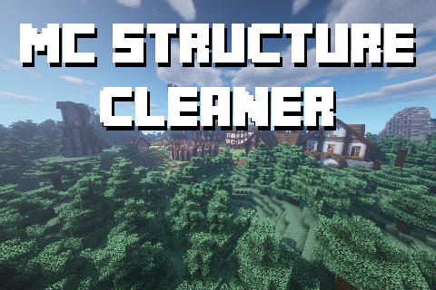

# MCStructureCleaner

Missing Structure Fix - Modded structure cleaner for minecraft. Removes all references to non-existent structures to allow for clean error logs and chunk saving. The program goes through every chunk, in every region file of the world, removing the relevant `structure reference` and `structure start` tags.

Designed to fix worlds suffering from the [[MC-194811] Missing structures will destroy saved worlds](https://bugs.mojang.com/browse/MC-194811) bug, where uninstalling a mod which generated custom structures causes the world to become unstable.

Fixes errors such as `Unknown structure start: <missing structure>`, `Failed to save chunk`

## Usage

### GUI (recommended)

Upcoming.

### Command Line

1. Install the requirements: [Python 3.x](https://www.python.org/) and [Matcool's Anvil Parser](https://github.com/matcool/anvil-parser).
2. Download the [latest release](https://github.com/Nyveon/MCStructureCleaner/releases/) and place `main.py` in the same directory as your world folder
   - **Example:** If it's a server: in the server folder, or if it is a singleplayer world, in the saves folder.
3. Run main.py with any of the following configuration properties. I recommend using [NBTExplorer](https://github.com/jaquadro/NBTExplorer) to find the name, or just letting the program fix all non-vanilla names by not inputting any tag.
   - `-h` For help on command line arguments.
   - `-t` For the tag you want removed, in quotes. Leave empty if you wish to remove ALL NON-VANILLA TAGS.
   - `-j` For the number of threads you want to run it on. Default: 2 x CPU logical processors.
   - `-w` For the name of the world you want to process. Default: "world".
   - `-r` For the name of the sub-folder (dimension) in the world. Default: "".
   - **Example 1:** This command will delete all non-vanilla structures (defined up to 1.17) in the overworld of the world "SMP"

   ```bash
   python main.py -w "SMP"
   ```

   - **Example 2:** This command will delete all occurances of "Better Mineshaft" and of "Better Stronghold" in the world "My World", in the Nether (DIM-1), using 8 threads.

   ```bash
   python main.py -t "Better Mineshaft" "Better Stronghold" -j 8 -w "My World" -r "DIM-1"
   ```

   If you are on windows, I recommend using PowerShell.
4. Let it run. This may take a while, depending on the power of your computer and the size of your world.
5. Replace the contents of your region folder with the contents of new_region.
6. Enjoy your now working world 😊

## Warnings

1. Always back up your worlds before making any changes to them.
2. Structure specific effects that remained after uninstalling the mod will no longer work for the removed structures (This includes locating structures and custom loot tables).
3. If you have corrupted region files (With the wrong data format, or a size of 0b) the script may crash.

## Developers

### Installation & Testing

#### Installation

Clone the repository, then install requirements:

```bash
pip install -r requirements.txt
pip install -r devrequirements.txt
```

#### Linting and style

Most standard linters are fine as long as the code is readable, the project files are currently linted with [flake8](https://flake8.pycqa.org/en/latest/).

#### Running tests

- **VSCode**: the testing environment is already configured, simply press the `Run Tests` button added by the [official Python Extension](https://code.visualstudio.com/docs/python/testing).
- **Command Line**:

```bash
pytest -v --cov=. tests/ --cov-report xml:cov.xml
```

- **Expected coverage:** The `structurecleaner` folder should have 100% coverage.

#### Making your own tests

1. Generate your expected input files and output files. This can be done easily by running the program on a world, and then copying the region folder to the `tests` folder, and renaming it to `expected_input` and `expected_output` respectively. However, for new formats it is important to thoroughly check the output or make it by hand with NBTExplorer!
2. Place them in the directory `tests/data/X` where X is the name of the test. (See other tests for reference)
3. Use `remove_tags_test` in the `tests` directory to create your test. (See other tests for reference)
4. Run pytest. The coverage should be the same as before, and the test should pass.

#### Todo & Contribution

Contributions are always welcome! See the [issues page](https://github.com/Nyveon/MCStructureCleaner/issues) for ideas, or feel free to suggest your own ideas.

## Notes

- Feel free to message me on discord (Nyveon#9999) or twitter (Nyveon) if you need help using it.
- **Why did we make this?** To save our own SMP world after uninstalling some mods and getting the MC-194811 error. We had spent a lot of time on it, and didn't want anyone else to have to lose their world to the same bug.
- Thanks to @DemonInTheCloset for contributing to multiprocessing and command line arugments.
- Thanks to @lleheny0 for contributing to file validation.


